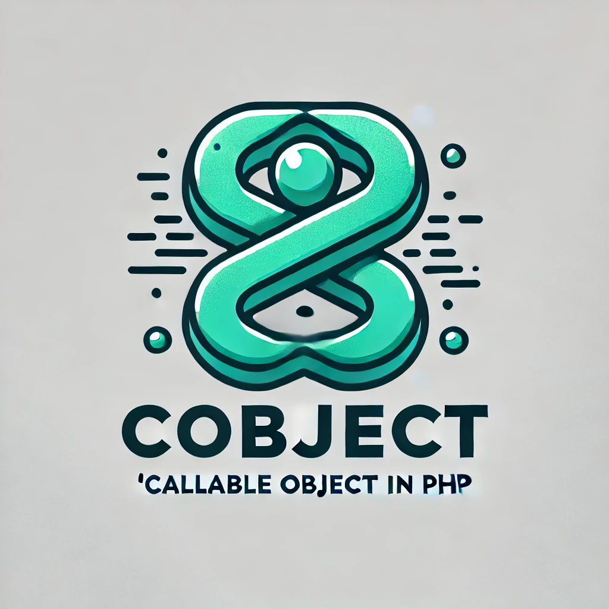

# cObject - Callable Object for PHP



**cObject** is an enhanced alternative to `stdClass` in PHP, providing additional functionality, including callable properties and seamless array-object conversion.  

## Features  

- **Extended `stdClass` functionality** – more powerful and flexible.  
- **Callable properties** – define properties that behave like functions.  
- **Direct array-to-object conversion** – easily transform arrays into objects.  
- **Effortless object-to-array conversion** – switch between formats with ease.  
- **Array-like object access** – interact with objects just like arrays.  

## Installation  

You can install `cObject` via Composer:  

```sh
composer require sajjad-razeqi/cobject
```

## cObject Documentation

### Usage cObject:

#### Like stdClass:

You can use it just like `stdClass`.

```php
use cObject\cObject;

$cObject = new cObject();

// Define:
$cObject->data1 = "Hello";
$cObject->data2 = function(string $name){
    echo "You're Welcome $name!";
};

// Usage:
echo $cObject->data1;
$cObject->data2("Sajjad");

// Unset:
unset($cObject->data1, $cObject->data2);
```

#### Convert an array to a cObject:

You can directly convert your array into a `cObject`.

```php
use cObject\cObject;

// Define:
$cObject = new cObject([
    "data1" => "Hello<br>",
    "data2" => function(string $name){
        echo "You're Welcome $name!";
    }
]);

// Usage:
echo $cObject->data1;
$cObject->data2("Sajjad");

// Unset:
unset($cObject->data1, $cObject->data2);
```

**Please note:** Only associative arrays can be converted to cObject. Otherwise, the array will remain unchanged in the `cObject`.
##### E.g.
```php
use cObject\cObject;

// Define:
$cObject = new cObject([
    "array" => [
        "data1",
        "data2",
        "data3",
        "data4",
    ]
]);

// Usage:
echo $cObject->array[0];

// Unset:
unset($cObject->array[3]);
```

#### Like Arrays:

You can use it just like `Arrays`.

```php
use cObject\cObject;

$cObject = new cObject();

// Define:
$cObject["data1"] = "Hello<br>";
$cObject["data2"] = function(string $name){
    echo "You're Welcome $name!";
};

// Usage:
echo $cObject["data1"];
$cObject["data2"]("Sajjad");

// Unset:
unset($cObject["data1"], $cObject["data2"]);
```

**Warning**: This only simulates an array but is not `iterable`.

#### Usage combination:
```php
use cObject\cObject;

// Define:
$cObject = new cObject([
    "data1" => "Hello<br>",
    "data2" => function(string $name){
        echo "hi $name!";
    }
]);
$cObject->data1 = "Ok, ";

// Usage:
echo $cObject->data1;
$cObject["data2"]("Sajjad");

// Unset:
unset($cObject["data1"], $cObject->data2);
```

### More options:

#### String casting:
When using string casting, the cObject will convert it to JSON.
```php
use cObject\cObject;

$cObject = new cObject([
    "data1" => "Hello<br>",
    "data2" => function(string $name){
        echo "You're Welcome $name!";
    }
]);

// ======================
echo $cObject; // { "_": "cObject", "data1": "Hello", "data2": {} }

// Or:
$string = (string) $cObject; // { "_": "cObject", "data1": "Hello", "data2": {} }
```
**Please note:** If you use string casting, any callable properties cannot be converted to a string. Additionally, after decoding the JSON string, the callable properties will be lost.

#### Convert the cObject to an array:
```php
use cObject\cObject;

$cObject = new cObject([
    "data1" => "Hello",
    "data2" => function(string $name){
        echo "You're Welcome $name!";
    }
]);

// ======================
$cObject->MycObjectToArray(); // return an array

// Or:
cObject::cObjectToArray($cObject); // return an array
```
